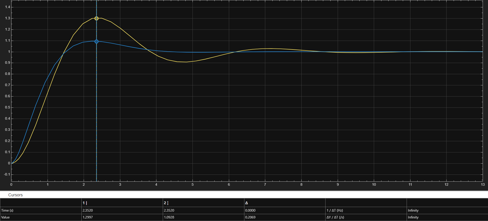
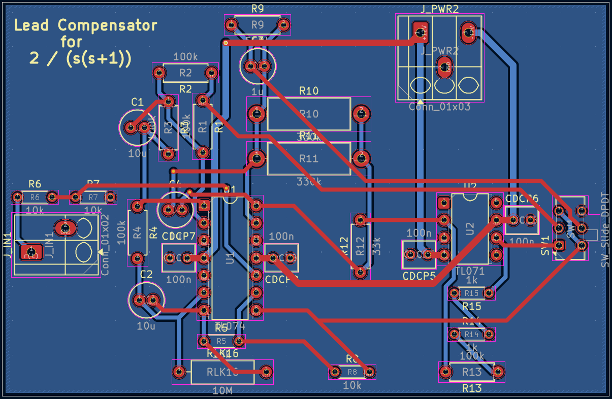
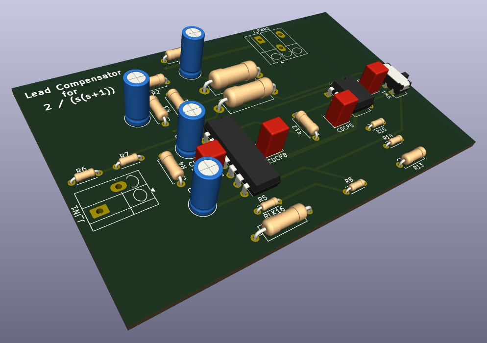

# Lead Compensator — Analog Control Design to PCB

End-to-end analog control project: a lead compensator designed from a control-oriented model, validated through simulation, and implemented as a PCB-ready analog circuit.

This repository demonstrates a complete workflow:
- **Model → Math verification (MATLAB) → Closed-loop evaluation (Simulink)**
- **Model → Analog circuit translation (LTspice)**
- **System-level verification with realistic constraints + switching (Proteus)**
- **PCB implementation and 3D previews (KiCad)**

---

## System overview

The compensated and uncompensated responses are compared under the same reference input, using a consistent closed-loop structure.

---

## Why this project matters (engineering perspective)

In real-world control work, the challenge is rarely “design a controller on paper.” The real value is proving that a design:
1) behaves as expected in a control model,  
2) still behaves in circuit-level simulation,  
3) survives practical constraints (component availability, switching, interconnects),  
4) can be carried to a manufacturable PCB layout.

This project is built to demonstrate exactly that pipeline.

---

## Toolchain and what each tool proved

### MATLAB (verification)
Used to validate the lead compensator transfer function and confirm that derived parameters match the expected behavior from control calculations.

### Simulink (system behavior)
Built a block-level closed-loop model to observe time-domain responses and compare compensated vs. uncompensated outputs.

### LTspice (circuit translation)
Re-created the **plant** and **lead compensator** as analog circuits (op-amp + RC networks), enabling direct observation of waveforms at circuit nodes and side-by-side comparisons.

### Proteus (final simulation + practicality)
Proteus was used for system-level verification **before PCB**, specifically to:
- implement a **switching** mechanism (DPDT-style) to toggle between **plant** and **compensated** paths,
- validate the full circuit behavior in a single simulation setup,
- adapt “ideal” values into **purchasable** parts (e.g., series/parallel resistor equivalents).

### KiCad (PCB implementation)
Schematic capture, footprint assignment, routing, and clean DRC checks, plus 3D board previews.

---

## Results snapshot

A quick view of uncompensated vs. compensated response behavior:

---

## PCB previews

Layout/routing view:

3D view (for mechanical/placement sanity and presentation):

---

## Repository structure

- `kicad/` — KiCad project files (`.kicad_sch`, `.kicad_pcb`, `.kicad_pro`)
- `matlab-simulink/` — MATLAB script + Simulink models (`.m`, `.slx`)
- `ltspice/` — LTspice schematic (`.asc`)
- `proteus/` — Proteus project (`.pdsprj`)
- `docs/images/` — figures used by this README

---

## How to open and run

### MATLAB / Simulink
1. Open `matlab-simulink/lead_compensator.m` and run it (verifies controller math).
2. Open `plant_comp.slx` and `uncomp_step_response.slx` to inspect signals and compare outputs.

### LTspice
1. Open `ltspice/lead-compensator.asc`
2. Run transient simulation and inspect key node voltages (plant vs. compensated behavior).

### Proteus
1. Open `proteus/lead-compensator.pdsprj`
2. Run the simulation and use the switch to toggle paths (plant ↔ compensated).

### KiCad
1. Open the project in `kicad/`
2. Inspect schematic and PCB, then check zones/DRC if desired.

---

## Notes on implementation realism

- Some “ideal” component values from the analytical design may not exist as single off-the-shelf parts.
  In such cases, values are intended to be achieved via **series/parallel combinations** while preserving the target transfer function.
- Switching between plant and compensated paths is included to support fast A/B comparison in simulation and testing workflows.

---

## License
Not specified.
